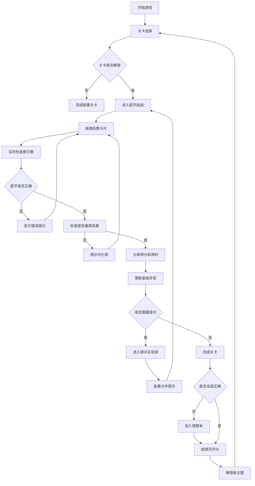

## 1. 产品概述

化学方程式配平大师是一款面向初中生的桌面化学学习游戏，通过拖拽交互和游戏化机制帮助学生掌握化学方程式配平技巧。游戏包含五大核心界面，从关卡挑战到错题复盘，形成完整的学习闭环。

- **核心价值**：将抽象的化学配平转化为直观的卡片拖拽游戏，降低学习门槛
- **目标用户**：初中三年级学生（13-15岁）
- **市场定位**：寓教于乐的化学学习工具，可作为课堂补充或家庭自学使用

## 2. 核心功能

### 2.1 用户角色

| 角色 | 注册方式 | 核心权限 |
|------|----------|----------|
| 学生用户 | 本地存储，无需注册 | 进行游戏、查看成绩、管理错题本 |

### 2.2 功能模块

1. **关卡选择页**：反应主题分类、难度递进、解锁机制、星级评定
2. **配平挑战页**：方程式展示、系数卡片拖拽、原子实时统计、正确性校验
3. **提示实验室页**：元素统计面板、最小公倍数算法建议、常见离子记忆卡片
4. **错题本页**：错误题目归档、错误系数记录、正确配平思路解析
5. **成绩页**：多维度评分（速度/连对/提示/知识点）、成就解锁、进度追踪

### 2.3 页面详情

| 页面名称 | 模块名称 | 功能描述 |
|----------|----------|----------|
| 关卡选择页 | 主题分类区 | 按反应类型分组展示（化合、分解、置换、复分解、氧化还原） |
| 关卡选择页 | 关卡卡片 | 显示星级、难度、锁定状态，点击进入挑战 |
| 配平挑战页 | 方程式展示区 | 左右两侧显示反应物和生成物，中间为等号/箭头 |
| 配平挑战页 | 系数卡片区 | 可拖拽的数字卡片（1-10），支持拖放到化学式前 |
| 配平挑战页 | 原子统计表 | 实时显示左右两侧各元素原子数量，配平正确时高亮 |
| 配平挑战页 | 反馈提示 | 配平错误时显示具体哪个元素不平衡 |
| 提示实验室页 | 元素统计分步提示 | 第一步：列出所有元素及原子数 |
| 提示实验室页 | 最小公倍数建议 | 第二步：计算LCM并给出系数建议 |
| 提示实验室页 | 离子记忆卡 | 第三步：展示常见原子团及化合价 |
| 错题本页 | 错题列表 | 按时间倒序展示所有做错的题目 |
| 错题本页 | 错题详情 | 展示原题、错误系数、正确答案、配平思路 |
| 错题本页 | 重做功能 | 可重新练习错题 |
| 成绩页 | 评分雷达图 | 四维评分（速度、连对、提示使用、知识点） |
| 成绩页 | 成就徽章 | 展示已解锁的反应主题成就 |
| 成绩页 | 统计数据 | 总题数、正确率、平均用时、最长连对 |

## 3. 核心流程

用户核心流程：选择关卡 → 拖拽系数配平方程式 → 系统实时校验 → 正确则过关并评分 → 错误则记录到错题本 → 可使用提示功能获得帮助 → 完成后查看成绩和解锁新内容。

## 4. 用户界面设计

### 4.1 设计风格

**设计方向：科技感+化学元素风**

- **主色调**：深蓝色 (#1e3a5f) 代表化学烧瓶的稳重，搭配霓虹青色 (#00d4ff) 代表实验室的科技感
- **辅助色**：橙色 (#ff6b35) 用于重要提示和操作按钮，绿色 (#00c853) 表示正确，红色 (#ff1744) 表示错误
- **字体**：标题使用 "Orbitron" 科技感字体，正文使用 "Noto Sans SC" 清晰易读
- **卡片样式**：圆角 12px，微玻璃拟态效果（background + backdrop-filter），悬停时有轻微上浮和发光效果
- **图标风格**：使用 lucide-react 线性图标，配合化学元素符号和烧瓶等主题图标
- **动效**：卡片拖拽时的3D倾斜、配平正确时的粒子爆炸效果、页面切换的渐入渐出

### 4.2 页面设计概述

| 页面名称 | 模块名称 | UI元素 |
|----------|----------|--------|
| 关卡选择页 | 主题分类区 | 大图标卡片、渐变色背景、解锁进度条、浮动动画 |
| 配平挑战页 | 方程式区 | 大字号化学式、可拖拽系数槽、元素下标、箭头动效 |
| 配平挑战页 | 原子统计表 | 左右两列对比、进度条显示平衡度、正确时脉冲动画 |
| 提示实验室页 | 分步提示 | 步骤指示器、折叠面板、离子卡片翻转动效 |
| 错题本页 | 错题列表 | 时间线布局、错误标记标签、展开查看详情 |
| 成绩页 | 评分区 | 雷达图、数字滚动动画、徽章解锁光效 |

### 4.3 响应性

- **桌面优先**：针对 Windows/macOS 桌面端设计，最佳分辨率 1280x800 及以上
- **触控优化**：拖拽区域设置最小 48x48px，支持触摸屏操作
- **自适应**：使用 CSS Grid 和 Flex 布局，在窗口大小变化时保持良好排版
- **键盘支持**：支持 Tab 键导航、Enter 确认、数字键快捷选择系数

### 4.4 视觉细节

- **背景**：深蓝色渐变 + 淡化学元素周期表水印 + 浮动粒子效果
- **卡片**：半透明玻璃效果，边框带微光，悬停时蓝色光晕
- **按钮**：圆角胶囊形，主按钮带渐变和阴影，点击时缩小反馈
- **拖拽**：拿起时卡片放大1.1倍，半透明跟随鼠标，放下时弹性动画
- **正确反馈**：绿色波纹扩散 + 粒子四散 + 音效
- **错误反馈**：红色边框抖动 + 文字提示渐显
