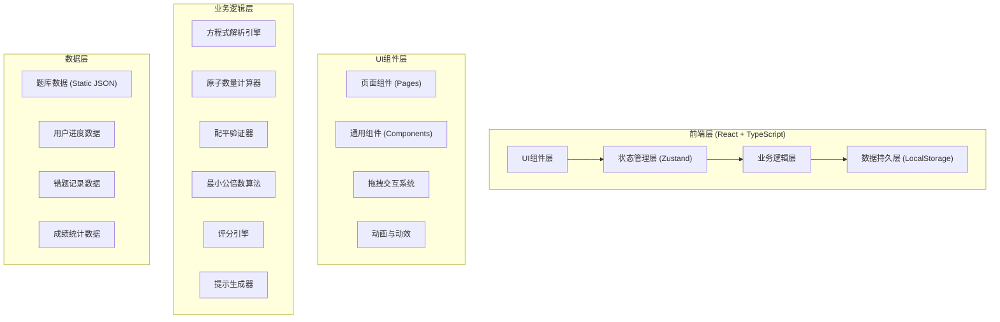
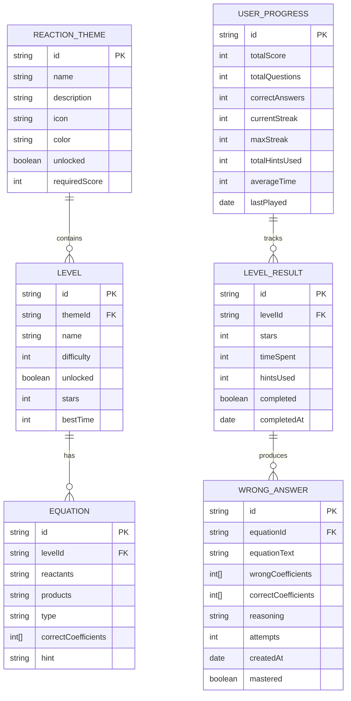

## 1. 架构设计



## 2. 技术描述

- **前端框架**: React@18 + TypeScript@5 + Vite@5
- **状态管理**: Zustand@4（轻量级，适合桌面应用）
- **样式方案**: TailwindCSS@3 + CSS Variables
- **路由管理**: React Router DOM@6
- **拖拽库**: @dnd-kit/core + @dnd-kit/sortable（现代化拖拽解决方案）
- **图标库**: lucide-react
- **数据可视化**: recharts（雷达图等）
- **数据持久化**: localStorage（无需后端）
- **初始化工具**: vite-init

## 3. 路由定义

| 路由路径 | 页面名称 | 功能描述 |
|----------|----------|----------|
| `/` | 首页/关卡选择 | 展示反应主题和关卡列表 |
| `/challenge/:levelId` | 配平挑战 | 拖拽系数卡片配平方程式 |
| `/hint-lab` | 提示实验室 | 分步提示和离子记忆卡 |
| `/mistakes` | 错题本 | 查看和重做错题 |
| `/stats` | 成绩页 | 评分和成就展示 |

## 4. 数据模型

### 4.1 数据模型定义



### 4.2 TypeScript 类型定义

```typescript
// 化学方程式相关类型
interface ChemicalCompound {
  formula: string;
  elements: { [element: string]: number };
}

interface Equation {
  id: string;
  reactants: ChemicalCompound[];
  products: ChemicalCompound[];
  type: 'synthesis' | 'decomposition' | 'single-replacement' | 'double-replacement' | 'redox';
  correctCoefficients: number[];
  hint: string;
  difficulty: number;
}

// 关卡相关类型
interface Level {
  id: string;
  themeId: string;
  name: string;
  description: string;
  difficulty: 1 | 2 | 3;
  equations: string[];
  unlocked: boolean;
  stars: 0 | 1 | 2 | 3;
  bestTime: number | null;
}

interface ReactionTheme {
  id: string;
  name: string;
  description: string;
  icon: string;
  color: string;
  levels: Level[];
  unlocked: boolean;
  requiredScore: number;
}

// 用户进度相关类型
interface UserProgress {
  totalScore: number;
  totalQuestions: number;
  correctAnswers: number;
  currentStreak: number;
  maxStreak: number;
  totalHintsUsed: number;
  averageTime: number;
  themes: { [themeId: string]: boolean };
  levels: { [levelId: string]: LevelResult };
}

interface LevelResult {
  levelId: string;
  stars: number;
  timeSpent: number;
  hintsUsed: number;
  completed: boolean;
  completedAt: string;
}

interface WrongAnswer {
  id: string;
  equationId: string;
  equationText: string;
  wrongCoefficients: number[];
  correctCoefficients: number[];
  reasoning: string;
  attempts: number;
  createdAt: string;
  mastered: boolean;
}

// 评分相关类型
interface ScoreBreakdown {
  speed: number;
  accuracy: number;
  streak: number;
  hints: number;
  knowledge: number;
}

interface HintStep {
  id: number;
  title: string;
  content: string;
  type: 'element-stats' | 'lcm' | 'ion' | 'method';
}
```

## 5. 核心算法模块

### 5.1 方程式解析引擎

```typescript
// 解析化学公式，提取元素及其数量
function parseFormula(formula: string): { [element: string]: number }

// 计算方程式某一侧的元素原子总数
function calculateAtomCount(
  compounds: ChemicalCompound[],
  coefficients: number[]
): { [element: string]: number }
```

### 5.2 配平验证器

```typescript
// 检查方程式是否配平
function checkBalance(
  equation: Equation,
  coefficients: number[]
): {
  isBalanced: boolean;
  details: {
    element: string;
    leftCount: number;
    rightCount: number;
    balanced: boolean;
  }[];
}

// 检查系数是否为最简比
function checkSimplestRatio(coefficients: number[]): boolean

// 求最大公约数
function gcd(a: number, b: number): number

// 求最小公倍数
function lcm(a: number, b: number): number
```

### 5.3 评分引擎

```typescript
// 计算单题得分
function calculateQuestionScore(
  timeSpent: number,
  hintsUsed: number,
  attempts: number,
  difficulty: number
): number

// 计算关卡星级 (1-3星)
function calculateStars(
  totalScore: number,
  timeSpent: number,
  hintsUsed: number
): 0 | 1 | 2 | 3

// 计算四维评分
function calculateScoreBreakdown(
  progress: UserProgress
): ScoreBreakdown
```

### 5.4 提示生成器

```typescript
// 生成元素统计提示
function generateElementStatsHint(equation: Equation): HintStep

// 生成最小公倍数建议
function generateLCMHint(equation: Equation): HintStep

// 生成常见离子提醒
function generateIonHint(equation: Equation): HintStep

// 生成配平方法建议
function generateMethodHint(equation: Equation): HintStep
```

## 6. 项目目录结构

```
src/
├── components/           # 通用组件
│   ├── layout/          # 布局组件
│   │   ├── Header.tsx
│   │   └── Navigation.tsx
│   ├── equation/        # 方程式相关组件
│   │   ├── EquationDisplay.tsx
│   │   ├── CoefficientSlot.tsx
│   │   ├── DraggableCard.tsx
│   │   └── AtomStatsTable.tsx
│   ├── ui/              # 基础UI组件
│   │   ├── Button.tsx
│   │   ├── Card.tsx
│   │   ├── Modal.tsx
│   │   └── ProgressBar.tsx
│   └── charts/          # 图表组件
│       └── RadarChart.tsx
├── pages/               # 页面组件
│   ├── LevelSelect.tsx
│   ├── Challenge.tsx
│   ├── HintLab.tsx
│   ├── Mistakes.tsx
│   └── Stats.tsx
├── store/               # 状态管理
│   ├── useGameStore.ts
│   ├── useProgressStore.ts
│   └── useMistakesStore.ts
├── data/                # 静态数据
│   ├── equations.json
│   ├── levels.json
│   └── ions.json
├── utils/               # 工具函数
│   ├── equationParser.ts
│   ├── balanceChecker.ts
│   ├── mathUtils.ts
│   ├── scoring.ts
│   └── hintGenerator.ts
├── types/               # 类型定义
│   └── index.ts
├── hooks/               # 自定义Hooks
│   ├── useDragAndDrop.ts
│   ├── useTimer.ts
│   └── useLocalStorage.ts
├── App.tsx
├── main.tsx
└── index.css
```

## 7. 状态管理设计

### 7.1 游戏状态 (useGameStore)

```typescript
interface GameState {
  currentLevelId: string | null;
  currentEquationIndex: number;
  coefficients: number[];
  startTime: number;
  elapsedTime: number;
  hintsUsed: number;
  attempts: number;
  isPaused: boolean;
  actions: {
    startLevel: (levelId: string) => void;
    setCoefficient: (index: number, value: number) => void;
    resetCoefficients: () => void;
    useHint: () => void;
    submitAnswer: () => boolean;
    nextEquation: () => void;
    pauseGame: () => void;
    resumeGame: () => void;
  };
}
```

### 7.2 用户进度状态 (useProgressStore)

```typescript
interface ProgressState {
  progress: UserProgress;
  actions: {
    loadProgress: () => void;
    saveProgress: () => void;
    updateLevelResult: (result: LevelResult) => void;
    updateThemeUnlock: (themeId: string) => void;
    updateStats: (correct: boolean, time: number, hints: number) => void;
    resetProgress: () => void;
  };
}
```

### 7.3 错题本状态 (useMistakesStore)

```typescript
interface MistakesState {
  wrongAnswers: WrongAnswer[];
  actions: {
    loadMistakes: () => void;
    saveMistakes: () => void;
    addWrongAnswer: (answer: Omit<WrongAnswer, 'id' | 'createdAt'>) => void;
    markMastered: (id: string) => void;
    removeWrongAnswer: (id: string) => void;
    clearAll: () => void;
  };
}
```
